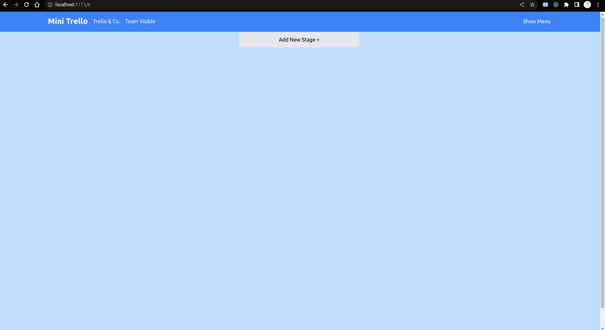
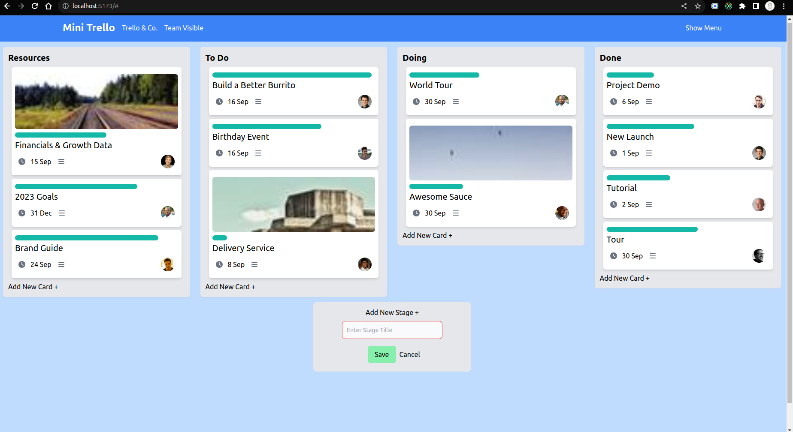
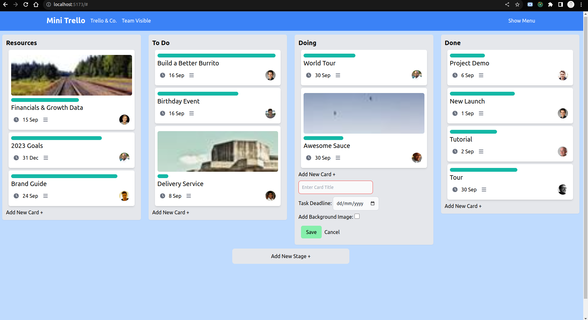
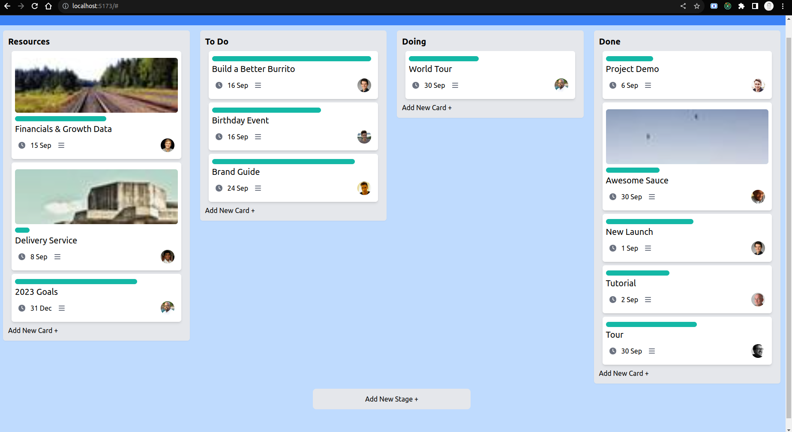
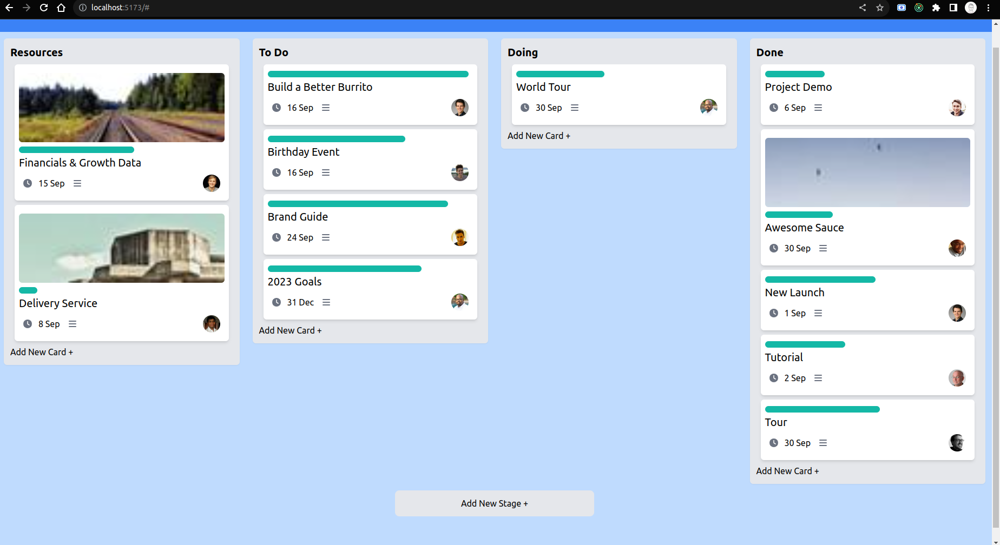
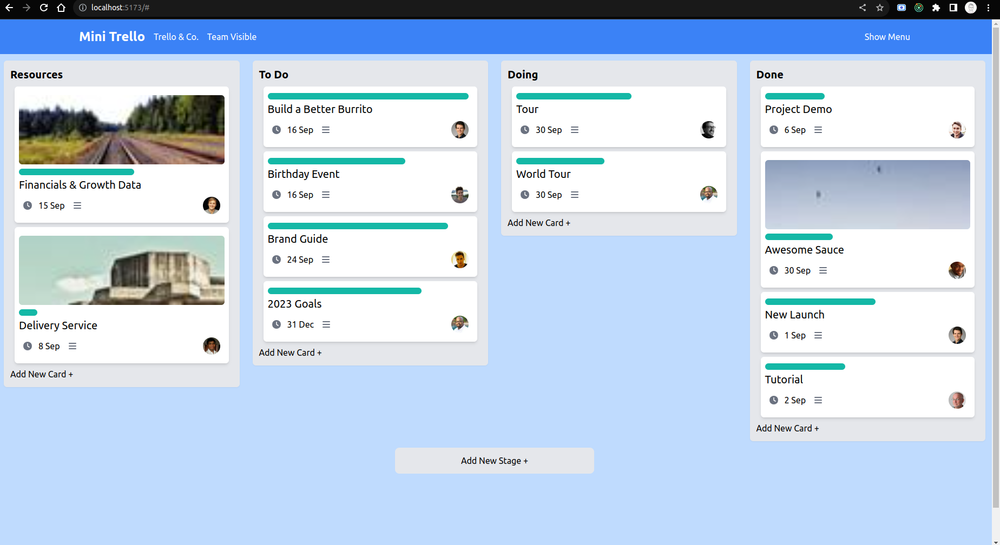

#  Trello Clone
## Introduction
This is the Frontend for a mini Trello Clone.
### Features
- Users can create boards
- Boards have stages like Todo, Doing, Done
- Stages have tasks
- Tasks can be dragged and dropped within the same stage or across different stages.

## GUI
User Interfase Screenshots.


















## Local Environment Setup
1. Clone this Repository
    ```bash
    git clone https://github.com/crediblebilal/zuddl-trello-clone.git
    cd zuddl-trello-clone
    ```
2. Install required node modules
     ```bash
    npm install
    ```
    
3. Start Local Server
     ```bash
    npm run dev
    ```
  
## Answers to given questions
**1. If a user can create and edit stages for a particular board. For example instead of Open > In Progress > Done if they want the stages of their task board to be Read > Working > Reviewing > Completed.**


**Ans:** *I have already made the Board flexible. In my implementation, user can create as many stages as they want as per their flexibility.*


**2. If users can comment on tasks ?**


**Ans:** *Since, I have implemented my project using the redux toolkit. If users can comment on the tasks, then for each task, I will create a key-value pair with comments as the key and the array of strings as the comments. When a user comments on a particular task, a redux store action will be dispatched which will add the comment to the particular task.*
 
**3. How will you do error handling?**

**Ans:** There are different approaches to do error handling in my application. Some of them are as follows:
- *Redux Middleware for API Calls*: When making API calls, use Redux middleware like Redux Thunk or Redux Saga to handle asynchronous operations and capture any API-related errors. I can dispatch actions to update the application state based on the success or failure of the API requests.
- *Use Redux Actions for Errors*: Create specific Redux actions and reducers to handle errors. For example, we can define actions like `setError` and `clearError` to set and clear error messages in the state. This will allow me to display error messages to the user when necessary.
- *Global Error Boundary*: Wrap the entire application or specific high-level components with React's ErrorBoundary component. This way, I can catch JavaScript errors that occur during rendering and provide fallback UI or log errors for debugging.
- *Displaying Errors to Users*: Create components or UI elements to display error messages to users in a user-friendly way. I can conditionally render these components based on the error state in Redux.
- *Logging Errors*: Use some logging library to capture and log errors that occur in the application. This helps to identify and fix issues in production.
